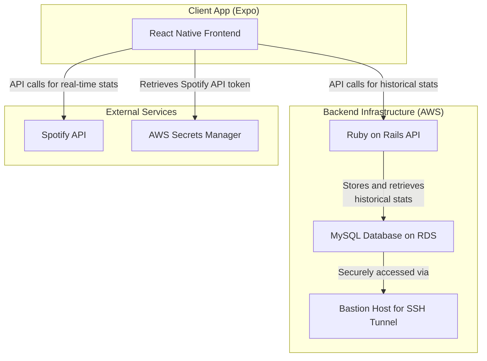

# Personal Spotify Stats App (React Native/Expo)

This application displays your personal Spotify statistics, featuring a React Native (Expo) frontend and a Ruby on Rails backend. It offers both real-time and historical views of your listening habits across mobile and web platforms.

-----

## Features

  * **Cross-Platform Analytics**: Seamless experience on iOS, Android, and Web using Expo.
  * **Premium Charts with Victory Native**:
    * **Ranking Movement**: Track how your top songs/artists change over time.
    * **Artist Loyalty**: Deep dive into artist retention and churn.
    * **Genre Diversity**: Multi-layered area charts showing your taste evolution.
    * **Popularity Heatmaps**: Visual distribution of your listening habits.
  * **Time Machine**: Browse and compare specific months of your listening history.
  * **Year in Review**: A beautifully animated annual summary of your top music.
  * **Historical Data Grouping**: Monthly stats are organized by year for easy browsing.

-----

## Demo

You can see screen recordings and screenshots of the app [here](https://brandonlc2020.github.io/Portfolio/project/8).

-----

## System Architecture



-----

## Technologies Used

### Backend

  * **Ruby on Rails**: A web application framework written in Ruby.
  * **Puma**: A Ruby web server for concurrent applications.
  * **MySQL**: A relational database management system.
  * **Rack CORS**: A Ruby middleware for handling Cross-Origin Resource Sharing (CORS).

### Frontend

  * **React Native (Expo)**: Framework for building native apps using React.
  * **TypeScript**: A typed superset of JavaScript.
  * **React Native Paper (MD3)**: Material Design 3 UI component library.
  * **Victory Native**: Powerful data visualization library for React Native.
  * **Axios**: Promised-based HTTP client.
  * **Spotify Web API**: Used for real-time data fetching.

### Infrastructure

  * **AWS RDS**: Hosts the MySQL database.
  * **AWS Secrets Manager**: Securely stores the Spotify API refresh token.
  * **Bastion Host**: Provides a secure SSH tunnel to the database.

-----

## Environment Variables and Configuration

Before running the application, you'll need to set up your environment variables for both the backend and frontend. There are `sample.env` files in both the `backend` and `frontend` directories to use as a template.

### Backend (`backend/.env`)

The backend requires credentials for your database and the bastion host used for the SSH tunnel.

  * `DB_PASSWORD`: Your database password.
  * `DB_USERNAME`: Your database username.
  * `DB_NAME`: The name of your database.
  * `DB_HOST`: The hostname of your database instance (e.g., an AWS RDS endpoint).
  * `BASTION_HOST`: The address of your SSH bastion host.
  * `BASTION_USER`: The username for the bastion host.
  * `BASTION_KEYFILE_PATH`: The local path to your SSH private key for the bastion host.

### Frontend (`frontend/.env`)

The frontend requires credentials for the Spotify API and AWS Secrets Manager. Note that in Expo, variables should be accessible either via `react-native-dotenv` or `process.env`.

  * `REACT_APP_CLIENT_ID`: Your Spotify application's Client ID.
  * `REACT_APP_CLIENT_SECRET`: Your Spotify application's Client Secret.
  * `REACT_APP_AWS_ACCESS_KEY_ID`: Your AWS access key ID.
  * `REACT_APP_AWS_SECRET_ACCESS_KEY`: Your AWS secret access key.
  * `REACT_APP_AWS_DEFAULT_REGION`: The AWS region.
  * `REACT_APP_SECRET_NAME`: The name of the secret in AWS Secrets Manager.

-----

## Setup and Installation

### Prerequisites

  * Ruby 3.3.4
  * Node.js and npm
  * Expo Go app (on your iOS/Android device)
  * MySQL

### Backend Setup

1.  **Clone the repository**:
    ```bash
    git clone https://github.com/brandonlc2020/personalspotifystatswebapp.git
    ```
2.  **Navigate to the backend directory**:
    ```bash
    cd personalspotifystatswebapp/backend
    ```
3.  **Install dependencies**:
    ```bash
    bundle install
    ```
4.  **Set up the database**:
      * Create and populate the `.env` file as described above.
      * Create and migrate the database:
        ```bash
        rails db:create
        rails db:migrate
        ```
5.  **Start the Rails server**:
    ```bash
    bin/dev
    ```

### Frontend Setup

1.  **Navigate to the frontend directory**:
    ```bash
    cd personalspotifystatswebapp/frontend
    ```
2.  **Install dependencies**:
    ```bash
    npm install
    ```
3.  **Set up Environment Variables**:
      * Create and populate the `.env` file from `sample.env`.
4.  **Start the Expo server**:
    ```bash
    npx expo start
    ```
5.  **Run on a device**:
    *   Scan the QR code with your camera or the **Expo Go** app to run on your phone.
    *   Press `i` for iOS simulator or `a` for Android emulator.
    *   Press `w` for web version.

-----

## API Endpoints

The backend provides the following API endpoints:

  * `GET /api/tracks`: Returns user's top tracks grouped by month/year.
  * `GET /api/artists`: Returns user's top artists grouped by month/year.
  * `GET /api/albums`: Returns user's top albums grouped by month/year.
  * `GET /api/analytics/...`: Advanced analytics endpoints (Dominance, Loyalty, Churn).

-----

## License

This project is licensed under the MIT License.
